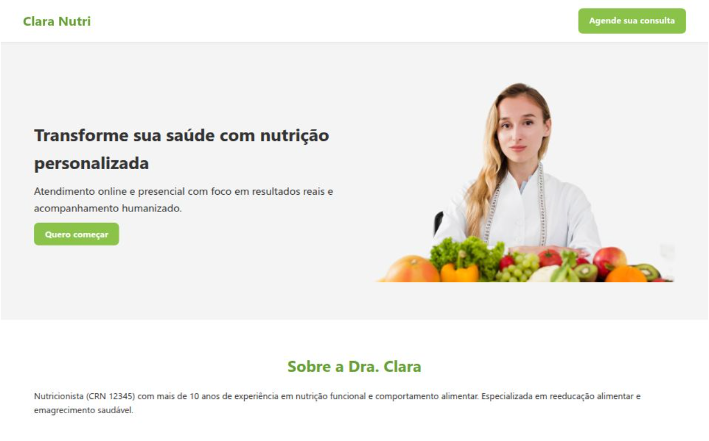

# Landing Page - Dra. Clara Nutri 🥗

Este é um projeto de uma landing page responsiva desenvolvido para uma nutricionista fictícia chamada **Dra. Clara**, com foco em conversão de leads, apresentação de serviços e presença digital profissional.

## 🔍 Sobre o Projeto

A landing page tem como objetivo atrair potenciais pacientes para consultas online e presenciais. O design é leve, moderno e otimizado para dispositivos móveis.

### Funcionalidades

- ✅ Design 100% responsivo
- ✅ Layout moderno com HTML5 + CSS3 puro
- ✅ Seções de apresentação, serviços e depoimentos
- ✅ Ícones integrados via Font Awesome
- ✅ Link direto para contato via WhatsApp e redes sociais
- ✅ SEO básico e metatags para compartilhamento social
- ✅ Favicon personalizado incluído

## 📸 Preview

 

## 🚀 Tecnologias Utilizadas

- HTML5
- CSS3 com media queries
- Font Awesome (ícones sociais)
- Responsividade mobile-first

## 📌 Como usar

1. Clone o repositório:
   ```bash
   git clone https://github.com/seu-usuario/clara-nutri-landingpage.git
   ```

2. Abra o `index.html` no navegador.

## 📝 Personalização

Você pode adaptar o conteúdo para uma nutricionista real alterando:

- Texto das seções
- Fotos e depoimentos
- Links de redes sociais
- Paleta de cores e fontes, se desejar

## 👩‍💻 Autora

Desenvolvido por [Ivanna Almeida](https://github.com/ivannatech).

---

> Este projeto é parte de um portfólio de desenvolvedora web freelancer e está disponível para uso não-comercial ou como base para novos projetos personalizados.
